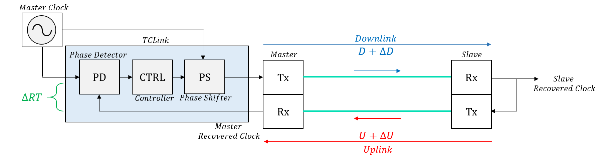
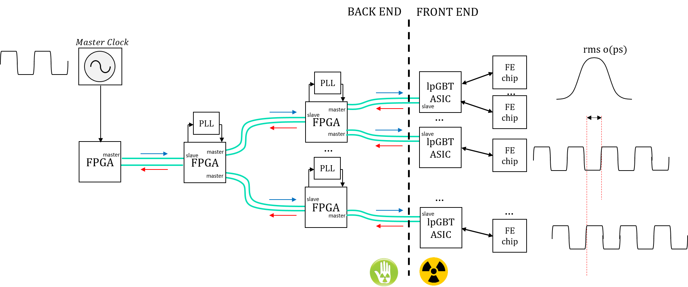
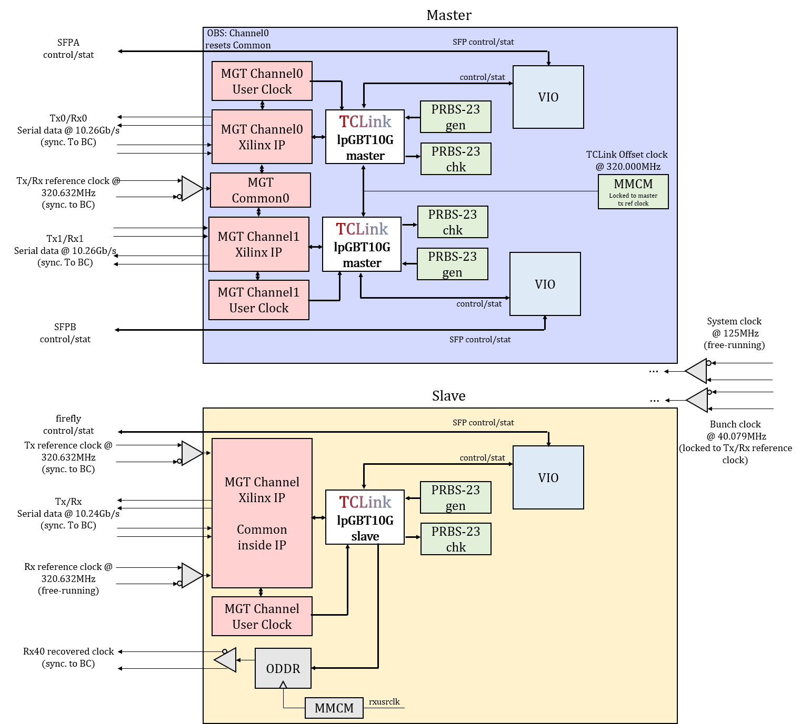

# Rev 1.4

## TClink concept

The TCLink is a protocol-agnostic FPGA core envisaged to mitigate long-term phase variations in high-speed optical links. The concept is to have monitoring and picosecond-level online adjustment capabilities which can be tailored by the user to best fit his/her own convenience and application requirements. We refer to a timing compensated link when the phase of the recovered clock is stabilized in a controlled-fashion to minimize variations arising from environmental changes in the experiments. The principle of phase monitoring/compensation is to rely on a roundtrip variation measurement to estimate the downlink phase variation as shown in the figure below.

TCLink can be implemented in a full timing distribution chain in order to provide a better long-term stability between the phase of two recovered clocks. A system overview is shown here below.

## TCLink lpGBT implementation protocol

- Despite TCLink being a protocol agnostic core, we provide in this example design a customizable wrapper (**tclink_lpgbt.vhd**) implementing TCLink and the lpGBT protocol. The wrapper file tclink_lpgbt.vhd is located under firmware/source. It can implement four different types of protocols (for back-end and front-end communication) which allows the design of a full point-to-point timing distribution system.

### Choosing a protocol (`g_PROTOCOL`)

The different protocols it can implement are documented in the package firmware/source/tclink_lpgbt_pkg.vhd, they are: 

- **SYMMETRIC_10G** (communication between FPGAs): Tx lpGBT uplink 10G-FEC5, Rx lpGBT uplink 10G-FEC5
- **SYMMETRIC_5G** (communication between FPGAs): Tx lpGBT uplink 5G-FEC5, Rx lpGBT uplink 5G-FEC5
- **FPGA_ASSYMMETRIC_RX10G** (communication between FPGA and lpGBT chip): Tx lpGBT downlink, Rx lpGBT uplink 10G-FEC5
- **FPGA_ASSYMMETRIC_RX5G** (communication between FPGA and lpGBT chip): Tx lpGBT downlink, Rx lpGBT uplink 5G-FEC5

<b>Warning:</b> 

- The core tclink_lpgbt has an unconstrained array user data input and output (**tx_data_i** and **rx_data_o**). Nevertheless, depending on the protocol chosen, the data-size is fixed. The functions **fcn_protocol_tx_width** and **fcn_protocol_rx_width** (available under **tclink_lpgbt_pkg.vhd**) can be used to retrieve the data-width for a given protocol. Read carefully the entity documentation before connecting those. 

- In case a mistake is made, an assertion failure-level shall appear. In Vivado, for assertions to work, you have to enable using the following TCL command **set_property STEPS.SYNTH_DESIGN.ARGS.ASSERT true [get_runs synth_1]**.

- Please note that the example design system clock must be 125MHz and come from a free-running source (it must be toggling before the FPGA configuration - Xilinx transceiver requirement).

### Choosing a master or a slave (`g_MASTER_NSLAVE`)

The core can be configured as a master or slave (only relevant for **SYMMETRIC_10G** and **SYMMETRIC_5G**) using the generic **g_MASTER_NSLAVE**. If you are unsure about whether a core shall be configured as a master or slave, please note the following definitions:

- Master: It receives a reference clock synchronous to the bunch-clock and transmits it to the next stage. It is where the TCLink core is implemented.

- Slave: Receives a free-running reference clock to the receiver, implements a fixed-phase recovery scheme to recover the bunch clock and re-uses its clock for transmission as shown in figures above. Therefore, the slave has two reference clocks. 

### Saving logic (`g_MASTER_TCLINK_TESTER_ENABLE`)

In order to save logic, the TCLink tester can be disabled by setting the following generic to False. In addition, the TCLink configuration ports can be set to fixed-values in order to save extra logic. This is not performed in the example design in order to have a full testability of the core.

### Using the integrated FSM for link initialization (`g_QUAD_LEADER`)

An example of FSM for link initialization was designed by CMS designer Jeroen Hegeman. This FSM is integrated inside the tclink_lpgbt core. In order to use it, this generic should map to True for the slave and master channels connected to the Xilinx quad common PLL resets (and False for the master channels not connected to the common PLL resets). More details in how to use this integrated initialization procedure are discussed in the file **design_choice_documents/tclink_mgt_reset_procedure.pdf**.

## Resources available

In this repository you can find:

- TCLink documentation available on the file **https://gitlab.cern.ch/HPTD/tclink/-/blob/master/tclink_reference_note.pdf**

- HPTD IP core documentation: **https://gitlab.cern.ch/HPTD/tx_phase_aligner/-/blob/master/tx_phase_aligner_reference_note.pdf**

- Example design for TCLink and lpGBT Symmetric 10G (lpGBT uplink protocol bidirectional) for back-end applications implemented on the VCU118 board (documentation on **quick_start_guide_vcu118.pdf**)

- Example design for TCLink and lpGBT-FPGA for back-end to front-end applications implemented on the KCU105 board (documentation on **quick_start_guide_kcu105.pdf**). This example design is analogous to the VCU118 but it implements no slave (the lpGBT itself is the slave) and has eight masters.

- Design choice documents available in design_choice_documents folder: **tclink_mgt_reset_procedure.pdf**, **tclink_slave_rx_recovered_clock.pdf** and **tclink_master_rx_transceiver_implementation.pdf**

## FAQ

**Q: Can I implement TCLink while using a different protocol than what is proposed here?**
A: Yes, TCLink is a protocol-agnostic core and therefore you do not have to use the lpGBT. However, additional example designs are not proposed. Read the section 3 of the reference note.

**Q: Can I run the example designs in my custom board?**
A: Yes, you will have to modify the **system_wrapper_....vhd** file to use the right GT for your reference board. In addition, you have to select the amount of desired channels (see constants **c_MASTER_NUMBER_QUADS**, **c_MASTER_NUMBER_CHANNELS**, **c_MASTER_CHANNEL_QUADS**, **c_MASTER_PLL_RESET_CHANNELS** and **c_MASTER_RESET_CHANNEL**). You have then to change the pin-out. Then add your necessary logic and it should be good to go.

**Q: Can I change clock frequencies in the example design?**
A: No, the example design is designed to work with the fixed frequencies given here.

**Q: My link is not locking. What shall I do?**
A: Debug step-by-step in the following order: starting from the master Tx, slave Rx, slave Tx and master Rx. Check that each part of the link is locked to the reference clock given to the master. The most common issue observed is either a polarity inversion or a fiber connection mistake (clean your fibers and check orientation of connectors).

**Q: I followed all the advices, read the reference note but I am still having an issue/question or advice. What shall I do?**
A: Contact me at eduardo.brandao.de.souza.mendes@cern.ch for support and feedback.
